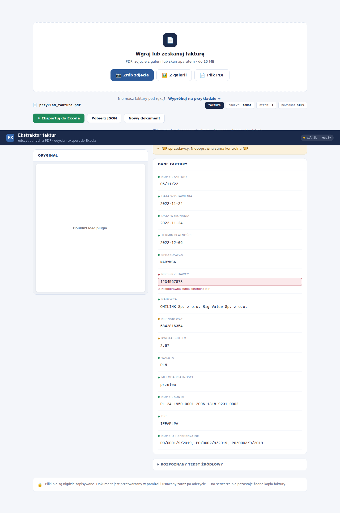

# 📄 Ekstraktor dokumentów (Document Extractor)

MVP systemu do **ekstrakcji ustrukturyzowanych danych z dokumentów PDF** — faktur, formularzy i skanów. Wgrywasz PDF, dostajesz JSON z rozpoznanymi polami (numer faktury, NIP, kwoty, daty, sprzedawca, pozycje...) plus czytelny podgląd w przeglądarce.

> Powstało jako przykład wdrożenia end-to-end pipeline'u przetwarzania dokumentów. Warstwa tekst → OCR → parser pól, gotowa do rozbudowy o LLM.



---

## ✨ Co potrafi

- **Wgranie PDF** przez przeglądarkę (drag & drop) lub przez API.
- **Skanowanie aparatem i wgrywanie zdjęć** — na telefonie można zrobić zdjęcie
  faktury lub wybrać je z galerii (JPG, PNG, WEBP, HEIC). Zdjęcia czyta Claude
  natywnie (lepszy odczyt krzywych zdjęć niż klasyczny OCR).
- **Wersja mobilna** — interfejs dostosowany do dotyku: duże pola, przyciski
  pełnej szerokości, układ jednokolumnowy.
- **Warstwowa ekstrakcja tekstu:** natywna warstwa tekstowa (pdfplumber),
  **fallback OCR** (Tesseract) dla skanów, tryb hybrydowy.
- **Dwa silniki ekstrakcji pól:**
  - **LLM (Claude)** gdy ustawiony jest klucz API — czyta układ faktury jak
    człowiek, poprawnie przypisuje NIP-y do stron, radzi sobie z dowolnymi układami;
  - **reguły (regex)** jako fallback, gdy klucza brak — repo działa od razu, bez konfiguracji.
- **Edytowalny formularz** — każde pole można poprawić przed eksportem, ze
  wskaźnikiem pewności odczytu przy każdym polu.
- **Eksport do Excela (.xlsx)** i JSON — z uwzględnieniem Twoich poprawek.
- **Walidacja pól** — suma kontrolna NIP, spójność kwot (netto + VAT = brutto),
  logika dat. Błędne pola podświetlają się na czerwono z komunikatem.
- **Podgląd oryginału** obok wyodrębnionych danych — łatwa weryfikacja odczytu.
- **Przycisk „wypróbuj na przykładzie"** — demo bez potrzeby własnej faktury.
- **Cztery języki interfejsu** — polski, angielski, niemiecki, francuski.
  Język wykrywany automatycznie z przeglądarki, z przełącznikiem do zmiany.
  Parser regułowy rozpoznaje też faktury DE/FR (słowa kluczowe), a LLM
  czyta dowolny język natywnie.
- **Prywatność** — pliki nie są nigdzie zapisywane, przetwarzanie w pamięci.

---

## 🏗️ Architektura

```
        ┌─────────────┐        ┌──────────────────────────────────────────┐
        │  Przeglądarka│  PDF   │              Backend (Flask)             │
        │  (drag&drop) ├───────►│  POST /api/extract                       │
        └──────▲──────┘  JSON   │                                          │
               │               │   ┌────────────────────────────────────┐ │
               │               │   │           extractor.py             │ │
               │◄──────────────┤   │                                    │ │
                    render()   │   │  1. pdfplumber  → tekst + tabele   │ │
                               │   │  2. Tesseract   → OCR (fallback)   │ │
                               │   │  3. regex/reguły→ pola + pozycje   │ │
                               │   │  4. confidence  → ocena pewności   │ │
                               │   └────────────────────────────────────┘ │
                               └──────────────────────────────────────────┘
```

### Pipeline krok po kroku

| Etap | Co się dzieje | Narzędzie |
|------|---------------|-----------|
| 1. Ingestion | odbiór pliku PDF (multipart) | Flask |
| 2. Ekstrakcja tekstu | natywny tekst + tabele z każdej strony | pdfplumber |
| 3. Fallback OCR | strony bez tekstu → obraz → OCR | Pillow + Tesseract |
| 4. Klasyfikacja | typ dokumentu (faktura / formularz / ogólny) | reguły słownikowe |
| 5. Parsowanie pól | regex + heurystyki na polach kluczowych | Python `re` |
| 6. Pozycje | tabele (siatka) lub wiersze tekstowe | pdfplumber + regex |
| 7. Ocena | wskaźnik pewności, ostrzeżenia | logika własna |
| 8. Odpowiedź | JSON → UI + plik do pobrania | Flask + JS |

---

## 🚀 Uruchomienie lokalne

### Wymagania systemowe
- Python 3.10+
- **Tesseract OCR** (dla skanów):
  ```bash
  # Ubuntu / Debian
  sudo apt install tesseract-ocr tesseract-ocr-pol tesseract-ocr-eng
  # macOS
  brew install tesseract tesseract-lang
  # Windows: https://github.com/UB-Mannheim/tesseract/wiki
  ```

### Instalacja i start
```bash
git clone https://github.com/<twoj-user>/doc-extractor.git
cd doc-extractor

python -m venv .venv
source .venv/bin/activate        # Windows: .venv\Scripts\activate

pip install -r requirements.txt
python app.py
```

Otwórz **http://localhost:5000** i wgraj PDF. Przykładowa faktura leży w `samples/`.

### Docker (alternatywa — Tesseract w zestawie)
```bash
docker build -t doc-extractor .
docker run -p 5000:5000 doc-extractor
```

---

## 🔌 Użycie API

```bash
curl -X POST -F "file=@samples/faktura_przyklad.pdf" \
     http://localhost:5000/api/extract
```

Przykładowa odpowiedź (skrócona):
```json
{
  "source_file": "faktura_przyklad.pdf",
  "document_type": "invoice",
  "extraction_method": "text",
  "page_count": 1,
  "confidence": 1.0,
  "fields": {
    "invoice_number": "FV/2026/08/0142",
    "tax_id_nip": "7012345678",
    "issue_date": "2026-08-05",
    "due_date": "2026-08-19",
    "net_amount": "17400.00",
    "tax_amount": "4002.00",
    "total_amount": "21402.00",
    "currency": "PLN",
    "seller": "DataForge Sp. z o.o.",
    "buyer": "Klient Testowy S.A."
  },
  "line_items": [
    {"description": "Wdrozenie pipeline RAG", "quantity": "1",
     "unit_price": "12000.00", "total": "12000.00"}
  ]
}
```

---

## 🧠 Silnik LLM (Claude) — dokładny odczyt dowolnych układów

Aplikacja działa **dwutorowo**:

- **Bez klucza API** → parser regułowy (regex). Szybki, darmowy, ale kruchy na
  nietypowych układach (myli strony na fakturach dwukolumnowych, gubi pozycje).
- **Z kluczem API** → **Claude czyta fakturę jak człowiek**: poprawnie przypisuje
  NIP-y do sprzedawcy/nabywcy, rozumie tabele o dowolnym układzie, radzi sobie
  z różnymi formatami dat i kwot. Silnik przełącza się automatycznie — bez zmian w kodzie.

W interfejsie widać, który silnik zadziałał (plakietka w prawym górnym rogu:
`silnik: LLM` albo `silnik: reguły`).

### Jak włączyć LLM

1. Zdobądź klucz API na **console.anthropic.com** (API Keys → Create Key).
   Weryfikacja telefonu daje ~5 USD kredytu na start — wystarczy na tysiące faktur.
2. Ustaw zmienną środowiskową:
   ```bash
   export ANTHROPIC_API_KEY=sk-ant-...      # lokalnie
   ```
   Na **Render**: panel usługi → **Environment** → dodaj `ANTHROPIC_API_KEY`.
   **Nigdy nie wpisuj klucza do kodu ani repo** — GitHub wykrywa klucze i je unieważnia.
3. Model domyślny to `claude-haiku-4-5` (najtańszy, ~ułamek grosza za fakturę).
   Można zmienić zmienną `LLM_MODEL`.

Koszt: faktura to ~2–4 tys. tokenów. Przy cenniku Haiku ($1/$5 za milion tokenów)
przetworzenie jednej faktury kosztuje ułamek grosza.

## 📊 Edycja i eksport do Excela

Wynik ekstrakcji to **edytowalny formularz** — każde pole można poprawić przed
eksportem (kliknięcie w pole → wpisanie poprawnej wartości; poprawione pola
podświetlają się na zielono). Kropka przy etykiecie sygnalizuje pewność odczytu:
zielona (pewne), pomarańczowa (warto sprawdzić — kwoty, NIP-y), czerwona (brak).

Dwa formaty eksportu:
- **Excel (.xlsx)** — sformatowany skoroszyt z danymi i pozycjami, gotowy do księgowości.
- **JSON** — do integracji z innymi systemami.

Eksport bierze **aktualne wartości z formularza**, więc Twoje poprawki trafiają do pliku.

---

## ☁️ Wdrożenie w chmurze (publiczny adres www)

Żeby ktokolwiek mógł wejść w link i wgrać plik, aplikacja musi stać na serwerze
dostępnym z internetu. Trzy rzeczy są konieczne niezależnie od platformy — i są
już w projekcie zrobione:

1. **Serwer produkcyjny** — Gunicorn zamiast serwera deweloperskiego Flask (`requirements.txt` + `Dockerfile`).
2. **Tesseract na serwerze** — instaluje go `Dockerfile`, więc OCR działa od razu.
3. **Port ze zmiennej `PORT`** — czyta go `app.py` i `Dockerfile`.

### Opcja A — Render (najprościej, darmowo, przez GitHub) ⭐

1. Wypchnij projekt na GitHub (patrz sekcja niżej).
2. Załóż konto na [render.com](https://render.com) (bez karty).
3. **New + → Blueprint** → wskaż swoje repo → **Apply**.
   Render odczyta `render.yaml`, zbuduje obraz z `Dockerfile` i wystawi aplikację.
4. Po ~2–5 min dostajesz publiczny adres `https://doc-extractor-xxxx.onrender.com`
   z HTTPS. Wchodzisz i wgrywasz PDF.

> **Haczyk darmowego planu:** aplikacja usypia po 15 min bezczynności; pierwszy
> request po przerwie trwa ~60 s (potem pełna prędkość). Płatny plan usuwa usypianie.

### Opcja B — Google Cloud Run (auto-skalowanie, płacisz za użycie)

Lepsze, gdy chcesz brak usypiania i skalowanie pod ruch. Wymaga konta Google Cloud
i narzędzia `gcloud`:

```bash
gcloud run deploy doc-extractor \
  --source . \
  --region europe-central2 \
  --allow-unauthenticated
```

Cloud Run zbuduje `Dockerfile`, wystawi HTTPS-owy adres i sam ustawi `PORT`.
Płacisz tylko za faktyczne przetwarzanie; przy zerowym ruchu koszt ≈ 0.

### Opcja C — dowolny VPS (pełna kontrola)

Na serwerze z Dockerem (np. Hetzner, DigitalOcean):
```bash
git clone https://github.com/<twoj-user>/doc-extractor.git
cd doc-extractor
docker build -t doc-extractor .
docker run -d -p 80:5000 --restart unless-stopped doc-extractor
```
Wskaż domenę na IP serwera; dla HTTPS dodaj reverse proxy (Caddy/Nginx + Let's Encrypt).

### Porównanie

| Platforma      | Koszt startowy | Usypianie | Trudność | Kiedy wybrać |
|----------------|----------------|-----------|----------|--------------|
| **Render**     | 0 zł           | tak (15 min) | ★☆☆ | demo, portfolio, MVP |
| **Cloud Run**  | ~0 zł (pay-per-use) | nie | ★★☆ | realny ruch, skalowanie |
| **VPS**        | ~20 zł/mc       | nie | ★★★ | pełna kontrola, stały serwer |

---

## 📁 Struktura projektu

```
doc-extractor/
├── app.py                # serwer Flask (API + serwowanie UI + eksport)
├── extractor.py          # silnik ekstrakcji (tekst / OCR / reguły / LLM)
├── llm_extractor.py      # warstwa LLM (Claude) z fallbackiem
├── excel_export.py       # generowanie pliku .xlsx
├── requirements.txt
├── Dockerfile
├── render.yaml           # konfiguracja wdrożenia na Render
├── .env.example          # wzór zmiennych środowiskowych
├── static/
│   └── index.html        # frontend (upload + edytowalny formularz + eksport)
├── samples/
│   └── faktura_przyklad.pdf
├── docs/
│   └── screenshot_result.png
├── README.md
└── LICENSE
```

---

## ⚠️ Ograniczenia MVP

- Parser regułowy działa najlepiej na typowych fakturach PL/EN; nietypowe układy mogą wymagać dostrojenia wzorców (lub warstwy LLM).
- Jakość OCR zależy od rozdzielczości skanu.
- Serwer deweloperski Flask — w produkcji użyj Gunicorn (jest w `Dockerfile`).

---

## 📜 Licencja

MIT — patrz [LICENSE](LICENSE). Używaj, zmieniaj, ucz się.
